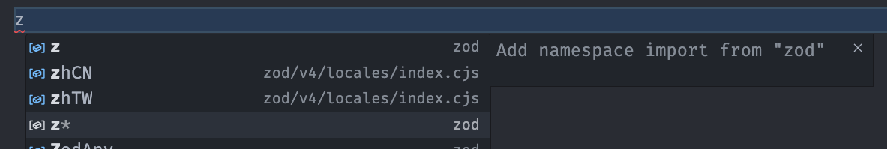

# Ace Imports

A VS Code extension that automatically creates asterisk (aka "namespace") imports (`import * as X from 'x'`) for installed packages.

Why? Because some libraries (like `zod`) recommend using namespace imports, but VS Code's auto-import feature does not support them, so you have to manually move your cursor to the top of the file and type it out yourself which can throw off your flow. This extension solves that problem by automatically creating the import statement for you, just like VS Code's auto-import feature does for normal imports.

## Usage

To start using Ace Imports, you need to provide your import rules in the extension settings. Import rules define what imports can be created. Here is a basic example that defines an import rule for `zod`:

```json
{
  "ace-imports.imports": [
    {
      "name": "z",
      "source": "zod"
    }
  ]
}
```

```js
import * as z from 'zod'
```

This rule will create the following import statement: `import * as z from 'zod'`. `name` defines the namespace (variable name) that will be used in the import statement, and `source` defines the path from which the import is made. By default, the extension will only show an import if it's source is detected in the nearest `package.json` file, so you don't have to worry about it showing imports for packages that are not installed.

When auto-importing a namespace import, the extension will add an item to VS Code's auto-completion menu, marked with an "\*", simply accept that suggestion to create the import statement.



You can also create an import by running the "Ace Imports: Insert Import" command from the Command Palette.

If the source of the import does not match the package name, you can specify the package name in the `dependency` field:

```json
{
  "ace-imports.imports": [
    {
      "name": "Schema",
      "source": "effect/Schema",
      "dependency": "effect"
    }
  ]
}
```

```js
import * as Schema from 'effect/Schema'
```

Additionally, you can use the `dependency` field to specify a version range for the dependency, so that the import can only be created if the correct version of the dependency is installed.

```json
{
  "ace-imports.imports": [
    {
      "name": "z",
      "source": "zod/v4",
      "dependency": "zod@^4.0.0"
    }
  ]
}
```

```js
import * as z from 'zod/v4'
```

This rule will create `import * as z from 'zod/v4'`, but only if your installed version of zod is at major version 4. The range specifier supports the [semver](https://semver.org) syntax ([cheatsheet](https://devhints.io/semver)).

If you have multiple import rules with the same `name`, the one with the highest matching dependency version will be used (imports that don't specify a dependency version are counted as having a version of `0.0.0` for this comparison). For example, we could use both our our `zod` examples together like this:

```json
{
  "ace-imports.imports": [
    {
      "name": "z",
      "source": "zod"
    },
    {
      "name": "z",
      "source": "zod/v4",
      "dependency": "zod@^4.0.0"
    }
  ]
}
```

Now the extension will create `import * as z from 'zod/v4'` if you have zod version 4 installed, if you have a different version of `zod` installed it will create `import * as z from 'zod'`.

_If two matching imports have the same dependency version, their priority is determined by the order they are defined in the settings, with the last one taking priority._

**Import Kind:** You can also specify the classification VSCode will apply to the import, which will affect the icon that is shown next to the suggestion item and possibly also the item's sorting order. This is done using the `kind` field, which accepts any of VS Code's `CompletionItemKind` enum values (when editting the settings your IDE will provide autocompletion for these). By default, the `Variable` kind is used, which is what a namespace import is actually classified as, so there isn't any situation where you need to change this, but it's there if you want to use it.

### Workspace Imports

If you have some imports that you only want to apply to a single project in addition to your main imports, you can define them in `ace-imports.workspaceImports`. Here you can define imports the exact same way as in `ace-imports.imports`, and they will be appended to your main imports. The idea is that you can define `ace-imports.imports` in your user setting and define `ace-imports.workspaceImports` in your workspace settings to add additional imports that are only relevant to that workspace.

```json
{
  "ace-imports.workspaceImports": [
    {
      "name": "z",
      "source": "zod/v4",
      "dependency": "zod@^4.0.0"
    }
  ]
}
```

### Disabling Imports

If you have some imports that your normally want to disable but may want enabled for some projects, you can use the `ace-imports.disabled` in your user settings to define a list of import IDs that should be disabled:

```json
{
  "ace-imports.disabled": ["zod-v4"]
}
```

Its important to note that we are referencing the import _ID_, which you have to define in the rule itself. So the above example requires you to have an import with `"id": "zod-v4"` defined in your settings.

Then in your workspace settings, you can re-enable the import by using the `ace-imports.workspaceAllowDisabled` setting:

```json
{
  "ace-imports.workspaceAllowDisabled": ["zod-v4"]
}
```

### Quote Style

You can specify the kind of quotes that should be used for the import statements using the `ace-imports.quoteStyle` setting. Can be `single`, `double`, `backtick` or `auto`, defaults to `auto`. If set to `auto` it will attempt to detect the quote style by looking at eslint/prettier config files, or the quote style used in the code. If no quote style can be detected double quotes will be used.

```json
{
  "ace-imports.quoteStyle": "single"
}
```

### Do Not Insert Semicolons

If you don't want the extension to insert semicolons when creating import statements, you can disable them:

```json
{
  "ace-imports.insertSemicolons": false
}
```

### Format Document/Organize Imports on Insert

You can configure the extension to automatically run the "Organize Imports" and/or "Format Document" actions after an import is added. This can help keep your code clean and organized.

```json
{
  "ace-imports.organizeImportsOnInsert": true,
  "ace-imports.formatDocumentOnInsert": true
}
```

### Disable Auto-Completion

If you don't want the extension to provide auto-completion suggestions for the imports, you can disable them:

```json
{
  "ace-imports.disableSuggestions": true
}
```

With this setting enabled the only way to insert an import is by running the "Ace Imports: Insert Import" command from the Command Palette.

### Full Example Config

```json
{
  "ace-imports.imports": [
    {
      "name": "z",
      "source": "zod"
    },
    {
      "name": "z",
      "source": "zod/v4",
      "dependency": "zod@^4.0.0"
    },
    {
      "name": "z",
      "source": "zod/mini",
      "dependency": "zod@>=4",
      "id": "zod-mini"
    }
  ],
  "ace-imports.disabled": ["zod-mini"]
}
```
